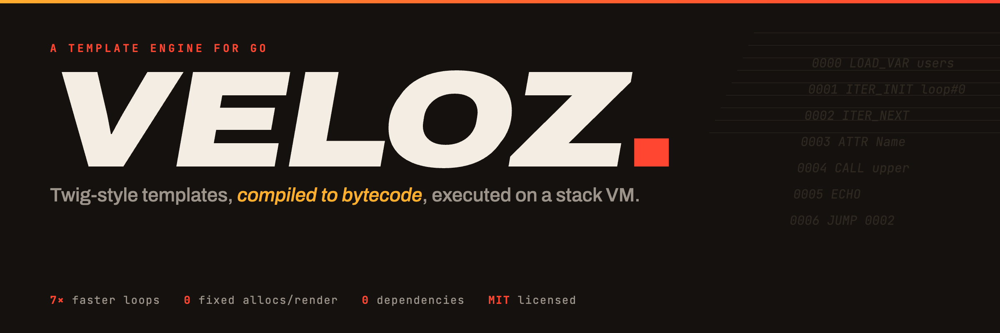
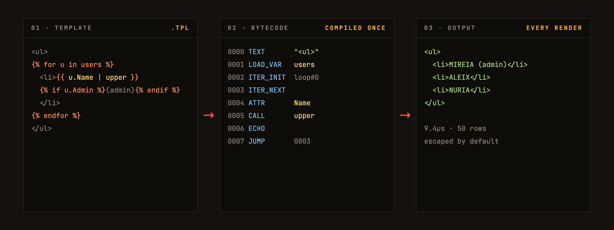
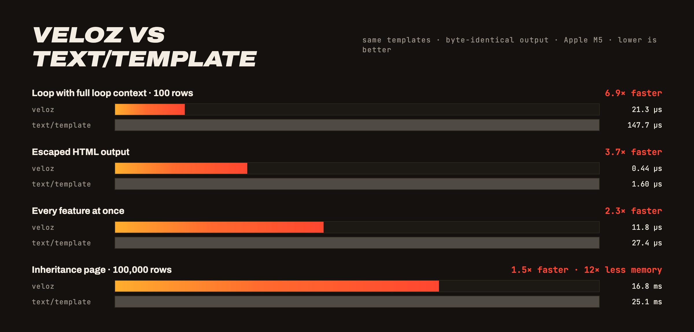

<p align="center">
  <a href="https://github.com/victoragudo/go-veloz/actions/workflows/ci.yml"></a>
  <a href="https://pkg.go.dev/github.com/victoragudo/go-veloz"></a>
  <a href="https://goreportcard.com/report/github.com/victoragudo/go-veloz"></a>
  <a href="LICENSE"></a>
</p>

<p align="center">
  <b><a href="https://victoragudo.github.io/go-veloz/">Website</a></b> ·
  <b><a href="https://victoragudo.github.io/go-veloz/docs.html">Documentation</a></b> ·
  <b><a href="#built-for-speed">Benchmarks</a></b>
</p>

Veloz is a template engine for Go. You write templates with a syntax similar to Twig, Jinja or Blade, and render them from your Go code with any data: maps, structs, slices or methods. It is made for the classic template jobs: HTML pages, emails, invoices, config files or code generation.

Use it when `text/template` feels too limited or too slow. Veloz gives you template inheritance, filters and a real loop context, and it compiles every template once to bytecode so rendering stays fast under load. It has no dependencies and one engine can be shared by all your goroutines.

```
go get github.com/victoragudo/go-veloz
```

## Parse once. Run at redline.

Most engines walk the syntax tree on every render. Veloz resolves variable paths, binds filters and lays out control flow **once, at compile time**. What runs at request time is compact bytecode on a pooled stack VM: no reflection walks, no tree traversal, no fixed allocations.



## Quick start

```go
package main

import (
    "fmt"

    veloz "github.com/victoragudo/go-veloz"
)

func main() {
    engine := veloz.New()

    tmpl, err := engine.Compile("hello", "Hola {{ name | capitalize }}!")
    if err != nil {
        panic(err)
    }

    out, _ := tmpl.Render(map[string]any{"name": "mireia"})
    fmt.Println(out)
}
```

If you have written Twig, Jinja or Blade, you already know the language:

```twig



  {{ loop.index }}. {{ line.concept | capitalize }} = {{ line.total() | money }}

Status: {{ invoice.paid ? "PAID" : "PENDING" }}
Client: {{ client ?: "guest" }}

```

## Built for speed

Same templates, same data, **byte-identical output** verified in the test suite. Run them yourself with `go test -bench . -benchmem`.



## Everything on board

| | |
|---|---|
| **Twig-style expressions** | Ternary, elvis `?:`, `in`, string concat `~`, power `**`, negative indexing, array and map literals |
| **Template inheritance** | `extends`, `block` with defaults and overrides, `include` for partials, cycle detection |
| **Real loop context** | `loop.index`, `first`, `last`, `revindex`, `length`, key-value iteration, `for/else` for empty lists |
| **20 built-in filters** | From `capitalize` to `nl2br`, plus custom filters and functions registered in one call |
| **Safe by default** | HTML autoescape with `raw` and `SafeString` escape hatches |
| **Fails at compile time** | Unknown filters and broken tags break `Compile`, never a production render |
| **Zero dependencies** | Standard library only, concurrent-safe engine, pooled interpreters |

## Documentation

The full reference lives at **[victoragudo.github.io/go-veloz/docs.html](https://victoragudo.github.io/go-veloz/docs.html)**: expressions, filters, functions, loops, inheritance, autoescape and the Go API, each with examples and their exact output.

## Contributing

Contributions are welcome. `main` only accepts pull requests with green CI and a maintainer review. See [CONTRIBUTING.md](CONTRIBUTING.md).

## License

[MIT](LICENSE)
